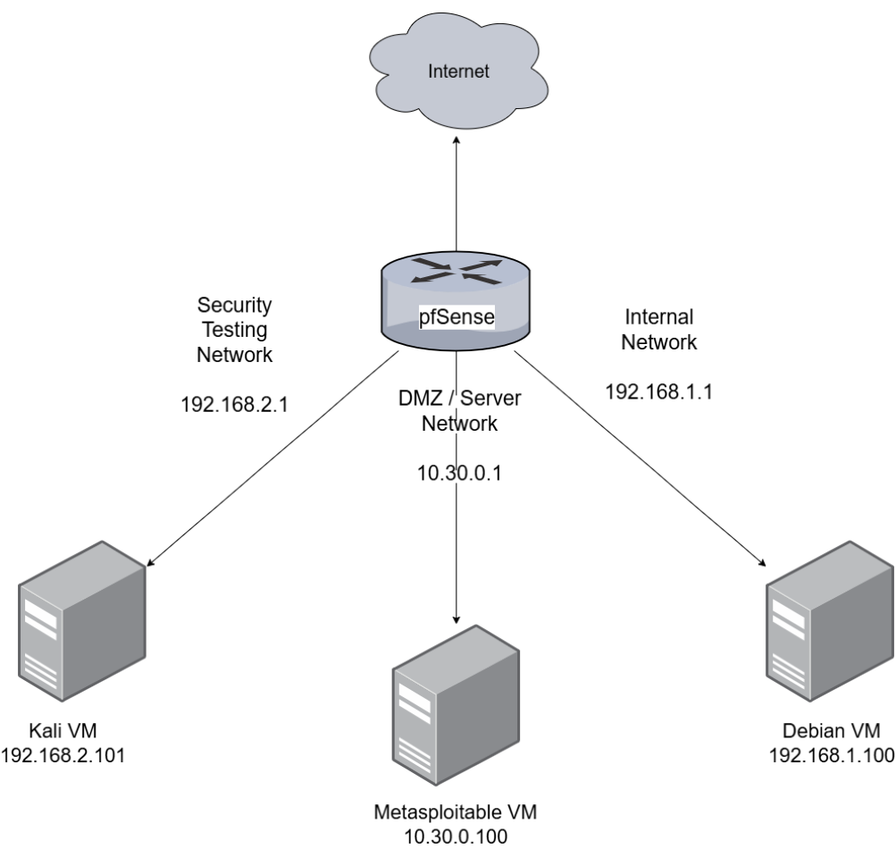
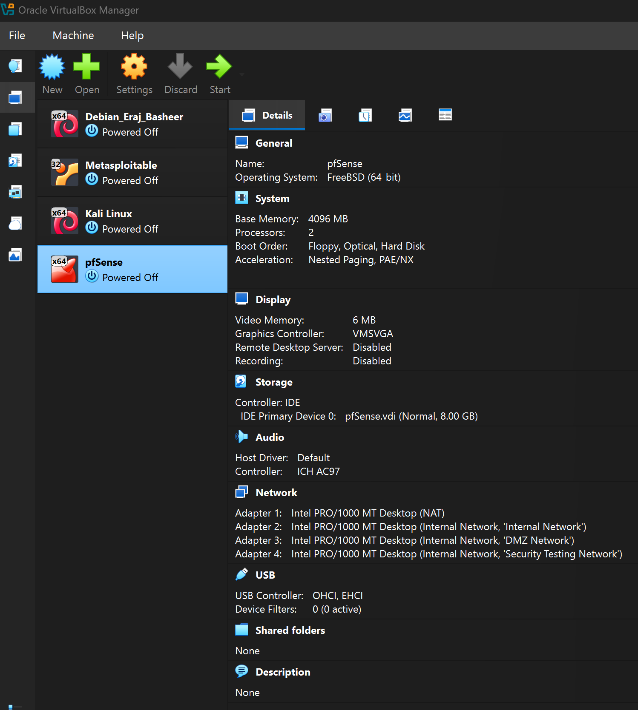
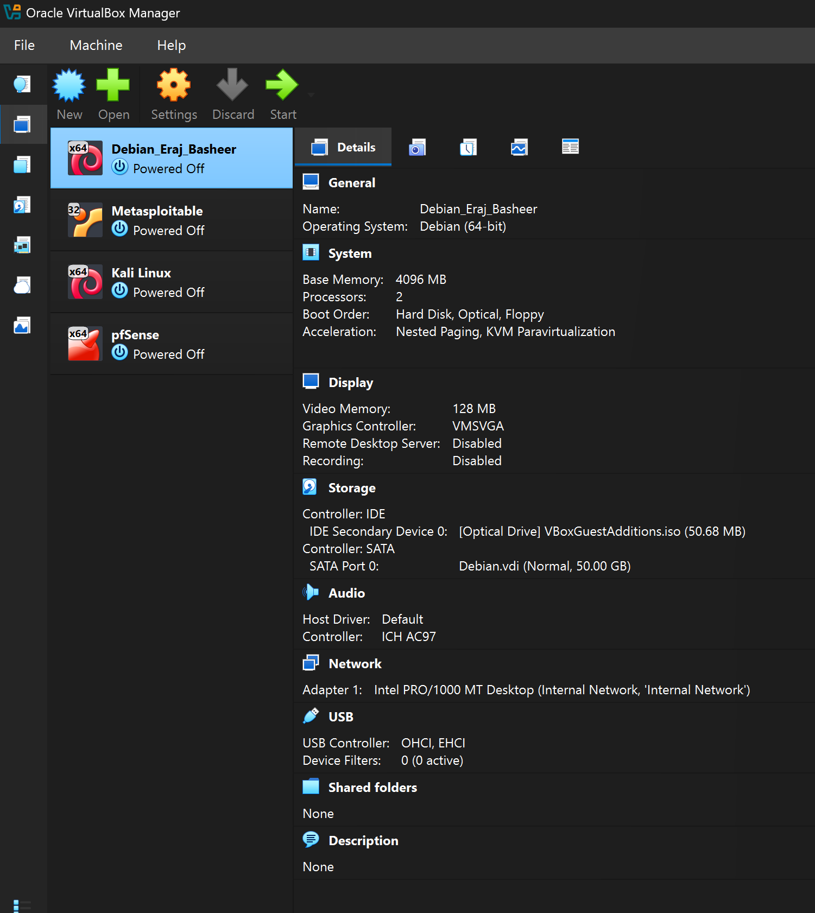
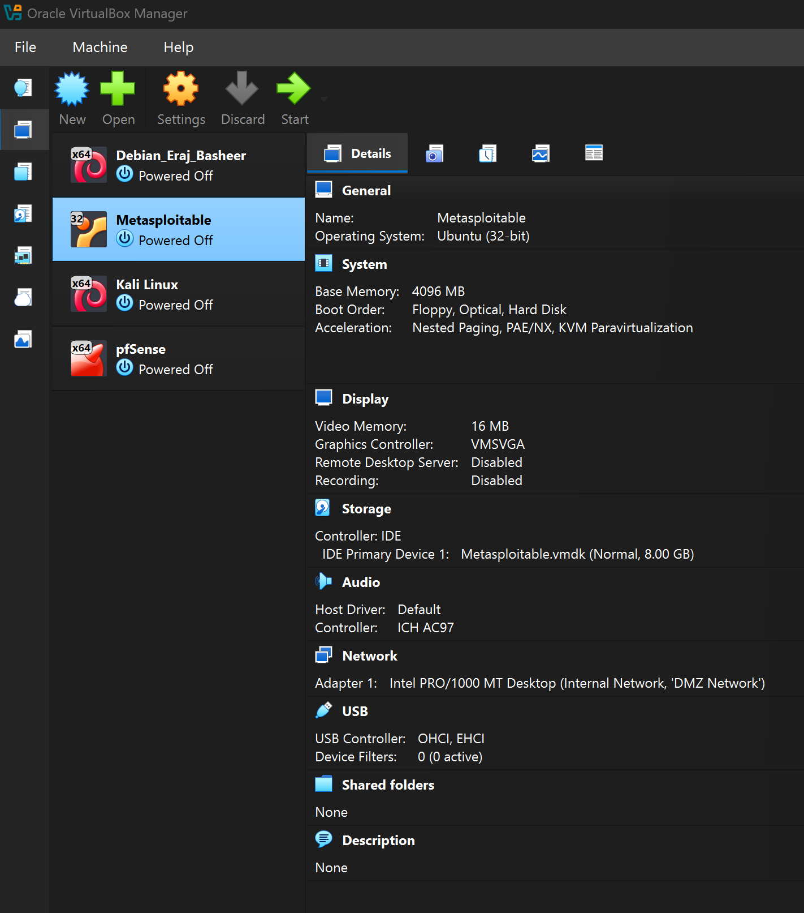
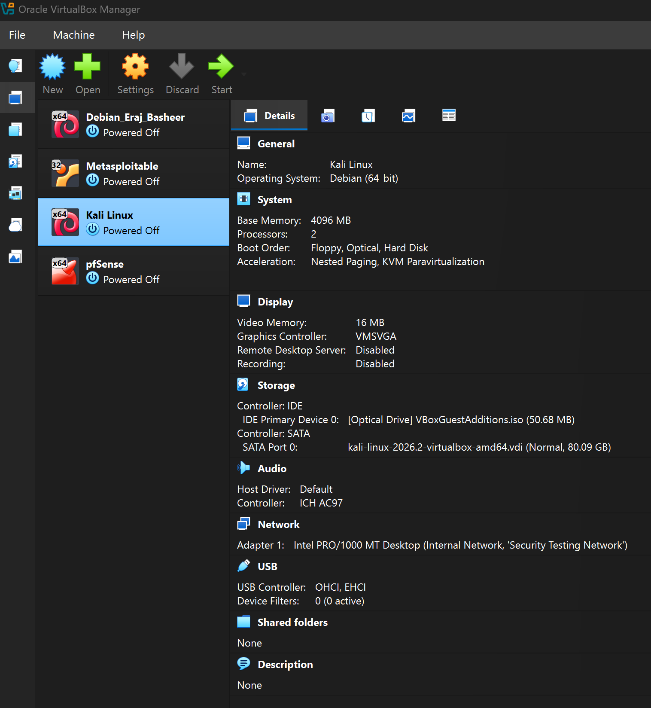
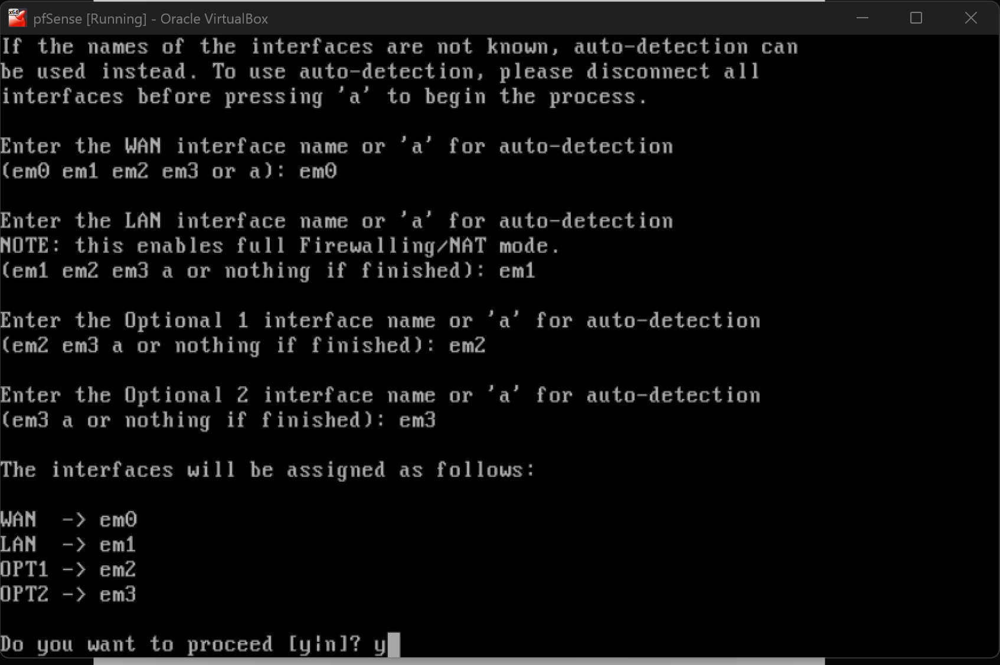
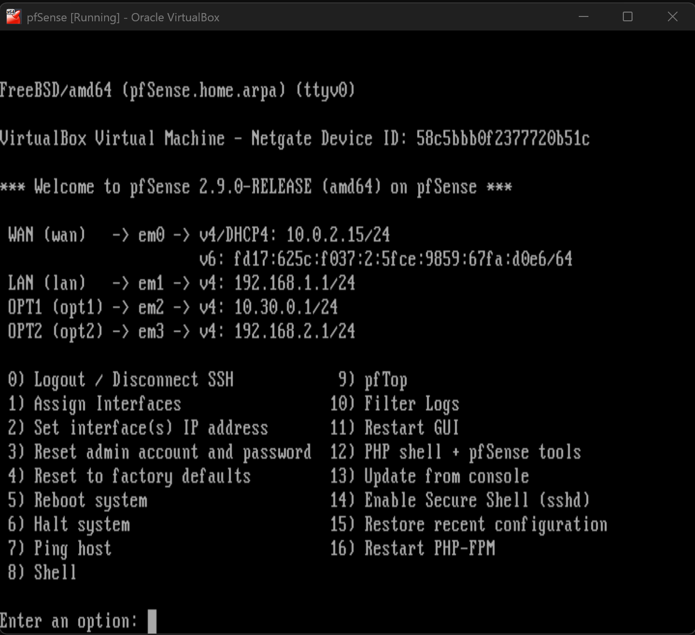
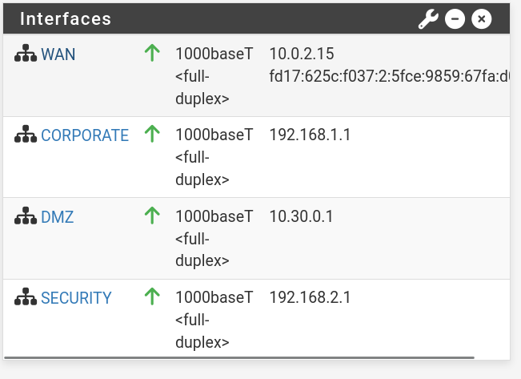
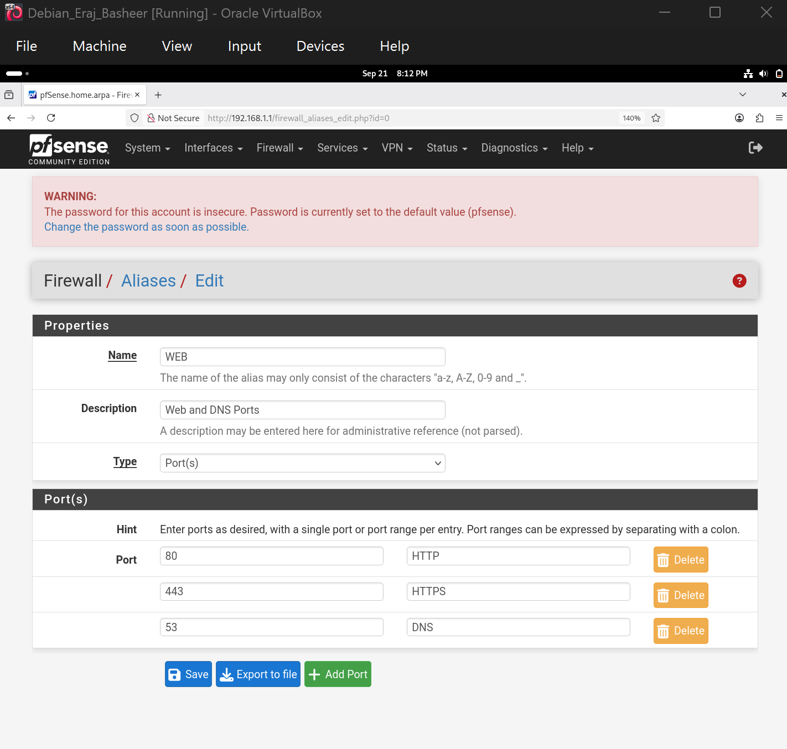
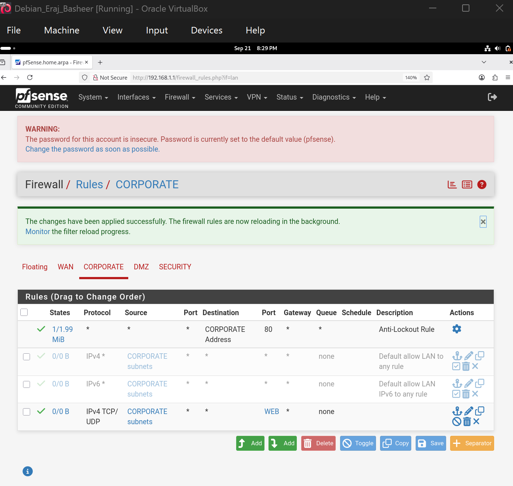

# pfSense Firewall Project


## Overview

This lab involved installing and configuring pfSense in a Oracle VirtualBox environment.

The objective was to create a segmented network environment containing an Internal Company Network, DMZ Network, Security Testing Network and WAN in order to configure and test firewall rules controlling traffic between these networks.

## Objectives 

- Configure VirtualBox virtual machines (Kali, Debian, pfSense, Metasploitable)
- Connect virtual machines to the appropriate networks
- Configure pfSense network interfaces
- Configure firewall rules
- Test allowed and blocked traffic


## Lab Environment

| Component | Purpose |
|---|---|
| pfSense | Firewall/Router |
| Debian | Internal Corporate Network Client |
| Metasploitable | DMZ Client |
| Kali Linux | Security Testing/Attacker Machine |

---

## Network Topology

| Network | Subnet |
|---|---|
| WAN | DHCP |
| Internal Network | 192.168.1.0/24 |
| DMZ Network | 10.30.0.0/24 | 
| Security Testing Network | 192.168.2.0/24 | 

### Network Diagram




## Virtual Machine Configurations 

Details of VirtualBox machine specifications are shown below:

### pfSense

Attached to: NAT, Internal Network

Network Name: Internal Network, DMZ Network, Security Testing Network




### Debian

Attached to: Internal Network

Network Name: Internal Network




### Metasploitable 

Attached to: Internal Network

Network Name: DMZ Network




### Kali 

Attached to: Internal Network

Network Name: Security Testing Network



---

## pfSense Configuration

### Interface Assignment

pfSense was installed successfully and the network interfaces were assigned correctly according to the network design.

| pfSense Interface | Port | Network | 
|---|---|---|
| WAN | em0 | WAN |
| LAN | em1 | CORPORATE | 
| OPT1 | em2 | DMZ | 
| OPT2 | em3 | SECURITY | 



### Interface IP Assignment

The interface IP addresses are then set according to the table below:

| pfSense Interface | Network | IPv4 Configuration |
|---|---|---|
| WAN | WAN | DHCP |
| LAN | CORPORATE | 192.168.1.1/24 |
| OPT1 | DMZ | 10.30.0.1/24 |
| OPT2 | SECURITY | 192.168.2.1/24 |




---


## Firewall Rules

After connecting to the pfSense webConfigurator, I renamed the interfaces to appear as shown below:



### CORPORATE Network Rules

Firewall rules were configured on the CORPORATE interface to allow only web traffic to all destinations.

- On the aliases page (under the firewall menu), I created a new alias named WEB, and added port 80 (HTTP), 443 (HTTPS) and 53 (DNS)


<br>

- On the firewall rules page, under the CORPORATE network, I disabled the second rule, which allows all traffic from the CORPORATE network to any
destination. I disabled this rule to create one that allows only WEB traffic to other networks.
- Then, I added a new CORPORATE rule, with the protocol set to TCP/UDP and then under destination port range I entered the WEB alias.



#### Testing:

I tested connectivity from the Debian VM to the Metasploitable VM using:

```bash
telnet <METASPLOITABLE-IP>
```

and HTTP access using a web browser.

#### Result

The Telnet connection was blocked/time-out occurred while HTTP access remained available according to the configured firewall rules.


---

### DMZ Network Rules

The DMZ network was configured with:

- A block rule preventing traffic from DMZ to INTERNAL
- A pass rule allowing other traffic

The block rule was placed above the pass rule so that the specific blocked traffic was processed first.


#### Testing

Connectivity was tested between the Metasploitable VM and the other networks.

**Expected result:**

- PURPLE → BLUE = blocked
- PURPLE → other permitted destinations = allowed
- 


---


## Firewall Testing Results

| Test | Expected Result | Actual Result |
|---|---|---|
| RED → BLUE | Blocked | [PASS/FAIL] |
| RED → PURPLE | Allowed | [PASS/FAIL] |
| PURPLE → BLUE | Blocked | [PASS/FAIL] |
| PURPLE → RED | Allowed | [PASS/FAIL] |
| BLUE → PURPLE | Allowed where rule permits | [PASS/FAIL] |

## Firewall Logs

Firewall logs were reviewed to confirm that traffic was being handled according to the configured rules.


## Conclusion

This lab demonstrated the configuration and testing of a pfSense firewall in a virtualised network environment. The firewall was used to control communication between internal, DMZ and security testing networks. Testing confirmed that the configured firewall rules could allow or block traffic according to the required security policy.
